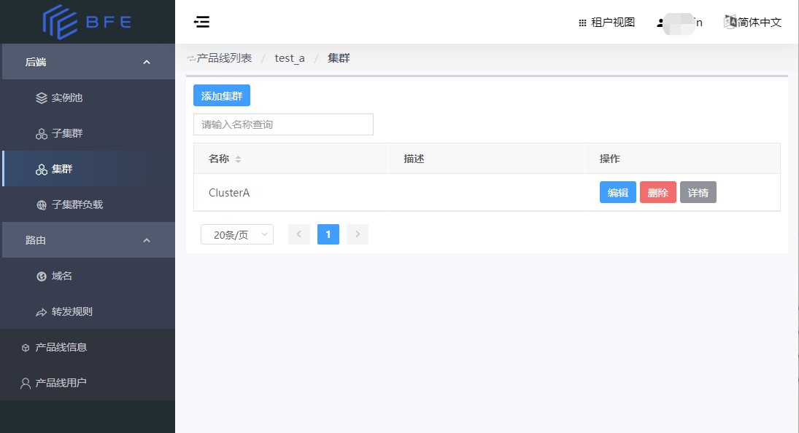

## BFE Dashboard

BFE Dashboard为 [BFE](https://www.bfe-networks.net/zh_cn/) 的用户提供了一种图形化的操作界面，可以对 BFE 的主要配置进行管理和查看。

## 使用指南

- [中文版](docs/zh-cn/user-guide/SUMMARY.md)

## 产出获取和部署
- [中文版](docs/zh-cn/deploy.md)

## 关于BFE

- 官网：https://www.bfe-networks.net
- 书籍：[《深入理解BFE》](https://github.com/baidu/bfe-book) ：介绍网络接入的相关技术原理，说明BFE的设计思想，以及如何基于BFE搭建现代化的网络接入平台。现已开放全文阅读。
