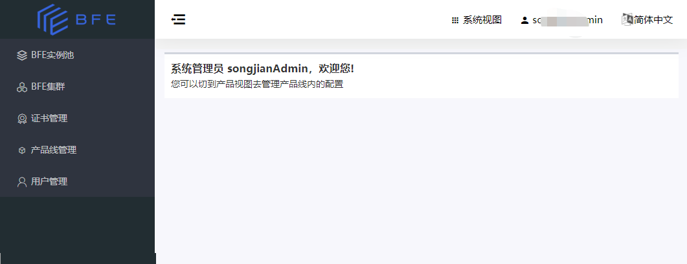

# 系统视图

只有系统管理员角色的用户可以进入系统视图：

- 系统管理员：
  - 在BFE Dashboard右上角的视图选择器，可以选择切换到系统视图。
  - 系统管理员登录后默认展示系统视图。

在系统视图，可以对整个BFE平台的公共资源（如BFE实例池、BFE集群、产品线、用户）进行管理。   

在系统视图内，主要的功能包括：
  * [BFE集群和BFE实例池的管理](system-view/bfe-cluster-and-pool.md)
  * [租户(产品线)管理](system-view/product-management.md)
  * [用户管理](system-view/user-management.md)
  * [证书管理](system-view/certificate.md)

