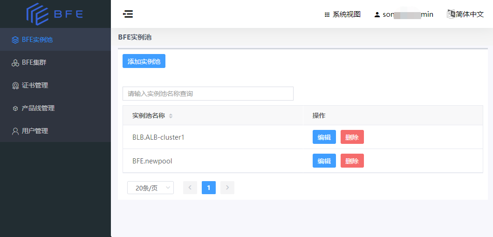
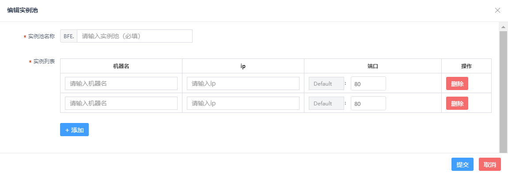
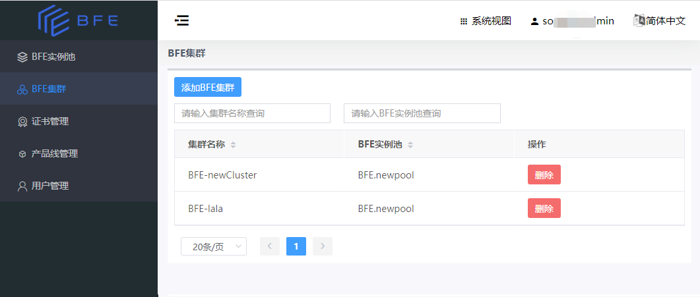
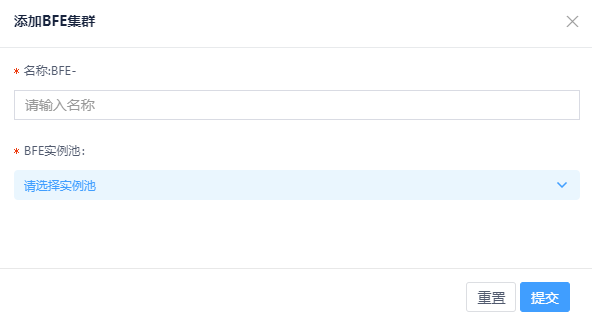

# BFE集群和BFE实例池

## 概述

- 一个BFE集群指一组BFE转发引擎实例组成的集群。
  - 若将BFE用于多数据中心的流量接入，可将位于同一个数据中心的BFE转发引擎实例组成一个BFE集群。

- BFE Dashboard增加了“BFE实例池”这个概念，由同一个BFE集群内的所有BFE转发引擎实例组成。
  - 每个BFE集群和一个BFE实例池对应。

在BFE Dashboard上管理BFE集群，首先要配置BFE实例池，然后配置BFE集群。

## BFE实例池的配置

在BFE Dashboard配置BFE实例池的操作步骤如下：

-   在系统视图，点击左侧菜单 “BFE实例池”

-   根据实际部署情况，添加BFE实例池。

-   注意：

    -   实例池名称在新建时设定，后续不可更改；
    -   每个实例池可包含多个实例；
    -   每个实例对应1个IP，1个端口；
-   点击“添加”后完成添加BFE实例池

## BFE集群的配置

在BFE Dashboard配置BFE集群的操作步骤如下：

-   在系统视图，点击导航栏的“BFE集群”

-   点击“添加BFE集群”，输入BFE集群名称，并选择对应的BFE实例池

-   点击“提交”后完成添加BFE集群

