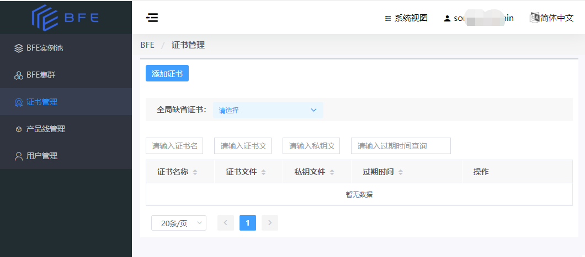

# 证书管理

## 证书管理概述

系统管理员可以统一管理SSL证书。

BFE可以绑定多个证书，并在SSL/TLS握手时根据SNI(Server Name Indication)扩展中包含的域名，自动匹配到一个证书。

若未匹配到证书，则会使用全局缺省证书。

## 查看证书配置

- 系统视图，点击左侧菜单，即可查看证书配置，如下图

## 添加证书

点击左上方的“添加证书”，即可在BFE系统中新增一个证书。

请填写证书名称、描述、过期时间，并上传证书文件和私钥文件。通过勾选isDefault，可以将该证书设置为全局缺省证书。

## 编辑

点击某个证书所在行的操作栏的“编辑”按钮，可以修改证书配置中该证书的过期时间。

注：证书实际过期时间以证书中包含的信息为准，此处仅是在BFE Dashboard中记录一下证书过期时间。

## 设置全局缺省证书

可以从已配置的证书中选择一个作为全局缺省证书。

点击页面上的“全局缺省证书”的下拉框，即可进行选择并设置。

