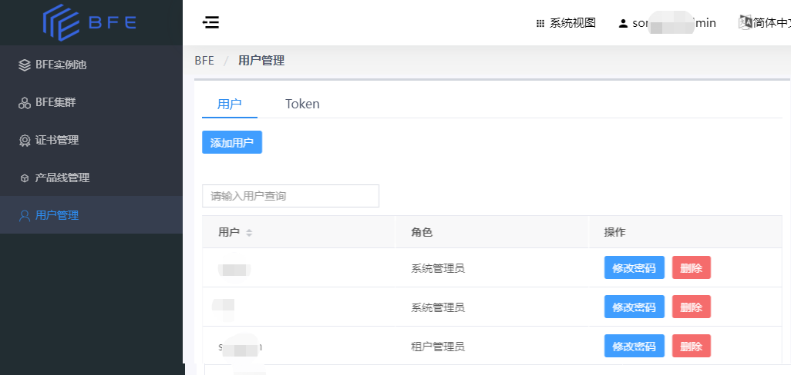
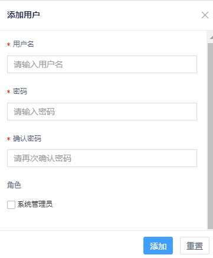
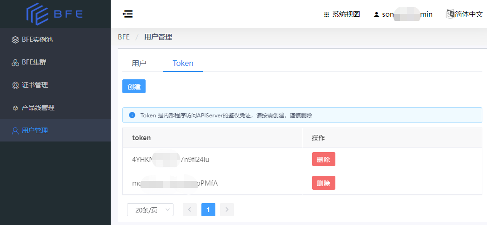

# 用户管理

BFE Dashboard中，系统视图的用户管理页面可以管理用户和Token。

- 用户：管理用于BFE Dashboard登录和操作的用户。

- Token：管理用于调用BFE的API时作为鉴权凭证的Token。

## 用户管理

### 查看用户列表

- 点击系统视图导航栏的“用户管理”，并选择“用户”的标签页。

### 添加用户

- 点击“添加用户”按钮，可以添加系统管理员角色用户或租户管理员角色用户。

- 若您希望创建的是系统管理员角色的用户，请在“角色”一项勾选“系统管理员”。

## Token管理

### 查看Token列表

- 点击系统视图导航栏的“用户管理”，并选择“Token”的标签页。

### 创建Token

- 点击“创建”按钮，可以创建一个新的Token。
- 已不再使用的Token，请及时删除。

 
