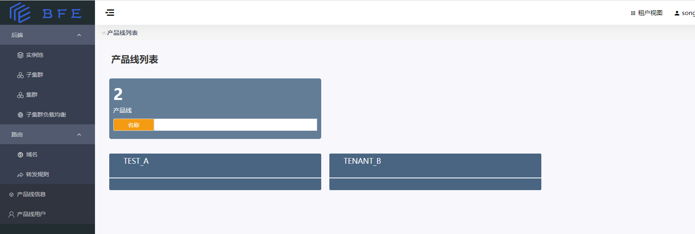

# 租户视图

系统管理员和租户管理员角色的用户均可以进入租户视图：

- 系统管理员：在BFE Dashboard右上角的视图选择器，可以选择切换到租户视图。

- 租户管理员：只有租户视图。登录完成后，即到达租户视图。

在租户视图，可以看到具有权限的产品线（租户）。点击相应的产品线卡片，即可进入产品线的管理功能页面。

   

在租户视图内，主要的功能包括：

* [服务后端配置](tenant-view/backend.md)
* [路由转发配置](tenant-view/route.md)
* [租户(产品线)信息管理](tenant-view/product-info.md)
* [租户(产品线)内的用户管理](tenant-view/product-user.md)

