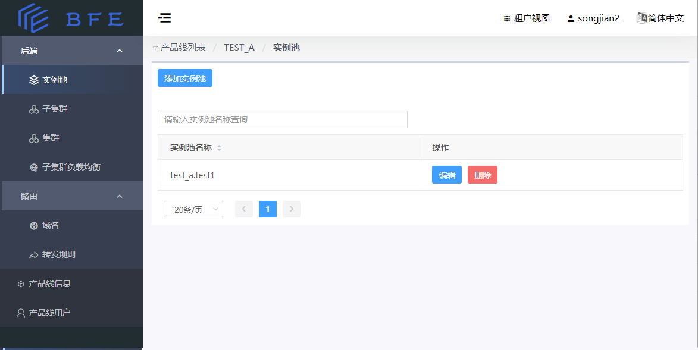
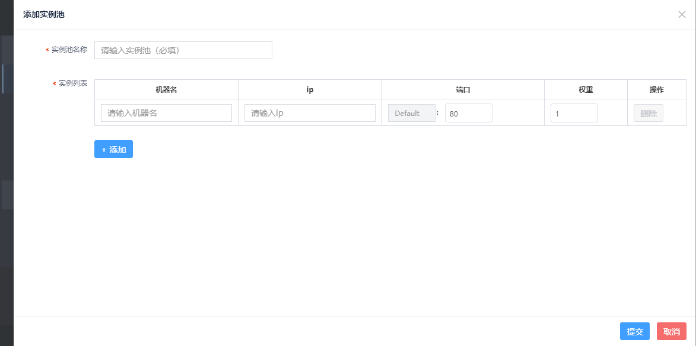
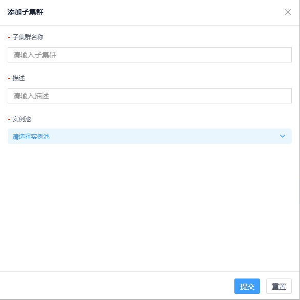
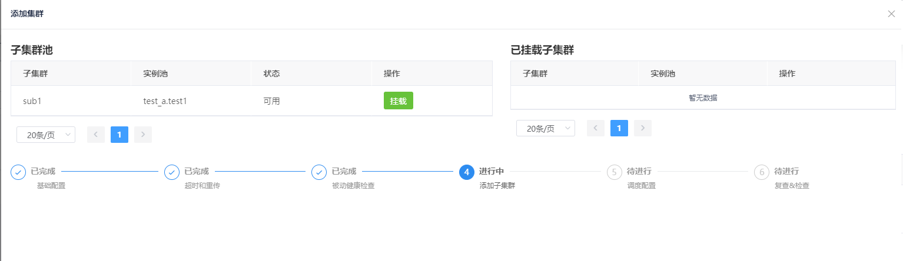
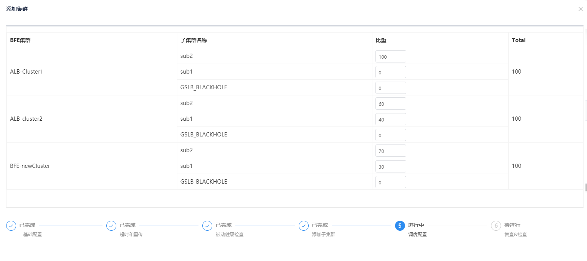

# 七层负载均衡基础配置

## 后端概述

使用BFE进行流量接入和七层负载均衡，产品线管理员需要配置后端的实例池、子集群、集群，以及集群内的子集群负载均衡。

相关概念如下：

### 集群

- 具有同类功能的后端的集合定义为一个集群(Cluster)。一个产品线中可定义多个集群。
- 通常，一个集群的范围可能跨越多个IDC。

### 子集群

- 集群又可以划分为多个子集群(SubCluster)。
- 通常，将集群中处于同一IDC中的后端定义为一个子集群。

### 实例池及实例

- 一个子集群可包含多个后端服务实例(Instance)，这些实例组成一个实例池
  - 即：一个子集群对应一个实例池
- 一个后端实例通过"IP地址 + 端口号"标识。
- 实例池内的实例可以设置权重，以实现实例池内的负载均衡。

## 实例池

本节说明如何新建一个实例池

-   租户视图，“后端”->“实例池”页，点击“添加实例池”

- 输入实例池名字以及实例相关信息，填写完成后点击“提交”

-   请填写实例池名称

-   请为实例池添加一个或多个实例，对于每个实例，需要填写：

    -   机器名

    -   IP

    -   端口：权重(weight)：实例池内部各个实例之间以加权轮询的方式进行负载均衡，所以需要为每个实例设置一个权重。请确保每个实例池至少有一个权重大于0的实例

-   以接入场景示例为例，需依次建立下列实例池：

## 子集群

本节说明如何新建一个子集群

-   进入“后端”-\>“子集群”页，点击“添加子集群”
-   输入子集群名词、描述，并为子集群选择关联一个实例池。

## 集群

本节说明如何新建一个子集群

-   进入“后端”-\>“集群”，点击“新建集群”，进入创建集群页面

添加集群步骤较多，下面按顺序说明。

### 设置集群的基础配置

集群的基础配置如下。部分参数详细解释可以参考BFE官方文档的[后端集群](https://www.bfe-networks.net/zh_cn/configuration/server_data_conf/cluster_conf.data/)。

-   **集群名称：** 在产品线内必须唯一

- **单个后端最大空闲连接数** ：BFE实例与每个后端的最大空闲长连接数（BackendConf.MaxIdleConnsPerHost）。
  默认值2。

-   **哈希策略** ：用于会话保持的请求来源标识的哈希策略。

    会话保持功能即：BFE向后端转发请求时，将相同来源的请求转发至固定的业务后端（某个子集群或某个实例）

     **支持如下三种哈希策略** ：

    -   CLIENT_ID_ONLY: 基于特定头部

    -   CLIENT_IP_ONLY: 基于请求来源IP

    -   CLIENT_ID_PREFERRED: 优先基于特定头部

-   **会话保持级别** ：用于会话保持级别的设置

    -   子集群级别：相同来源请求，被转发至固定的业务子集群（注：子集群中的任意实例）

    -   实例级别：相同来源请求，被转发至固定的业务实例

-   **请求写缓存大小** ： ReqWriteBufferSize。接受请求时，用的缓冲大小。

    默认值512。

-   **请求刷出时间** ：

    请保持默认值0ms

-   **响应刷出时间** ：

    请保持默认值-1(表示不使用响应刷出时间)

-   **后端连接随客户端连接关闭**： 

    -   默认值为停用。

    -   设置为启用(true)时，当客户端关闭连接后，BFE同时关闭到后端实例的连接

    -   设置为停用(false)时，当客户端关闭连接后，BFE按默认策略决定是否关闭到后端实例的连接

### 设置超时和重传

超时和重传设置包括：

-   **客户端连接空闲超时**：对于BFE和客户端之间建立的HTTP长连接,通信从上一个请求结束，到完成读取下一个请求头部之间的超时设置。单位为ms。

-   **读用户请求body超时**：    对于BFE收到的客户端请求，从完成读取请求头部，到完成读取请求主体的超时设置。单位为ms。

-   **连接后端超时**：从BFE向后端业务集群的实例发起建立连接，到建立连接完成的超时设置。单位为ms。

-   **读后端响应头部超时**：从BFE开始向后端业务集群的实例发送请求，到完成接收响应头部的超时设置。单位为ms。

-   **写响应超时** ：   从BFE向客户端发送响应头部开始，到将响应完全发送给客户端的超时设置。单位为ms。

-   **同子集群重试次数**：BFE转发失败后，尝试将请求转发到在原目标子集群内的实例进行重试的最大重试次数。默认值为2.

-   **跨子集群重试次数**：BFE转发失败后，尝试将请求转发到在其他子集群内的实例进行重试的最大重试次数。默认值为0，即不进行跨子集群重试。

### 设置健康检查配置

-   **健康检查间隔** ：启动健康检查后，健康检查请求的时间间隔。

-   **健康检查启动阈值**：BFE对某个后端实例连续转发失败次数超过这个阈值时，将该实例设为不健康，并停止向其转发请求，同时启动健康检查。

-   **健康检查Host**：健康检查请求是一个HTTP请求，此处定义请求的Host字段。

-   **健康检查Uri**：健康检查请求是一个HTTP请求，此处定义请求的Request-URI字段(abs_path格式，即绝对路径格式)。

    -   例如：要配置健康检查请求的地址为http://www.test1.com/interface，则可将Host配置为`www.test1.com`，将Uri配置为`/interface`。

-   **健康检查期望的状态码**：定义期望后端实例返回的http状态码

    -   常见的是200，也允许定义其他返回码

    -   若填写为0时，表示忽略返回码，只要能返回响应即可

### 挂载子集群

-   可以点击“子集群池”中可用状态的子集群的“挂载”按钮将子集群添加到集群。

-   “已挂载子集群”列表中可以看到已经选择挂载的子集群，点击“移除”则可以将某个子集群从该集群移除。

### 配置子集群间的负载均衡模式（子集群负载均衡）

BFE支持[集群内流量负载均衡](https://www.bfe-networks.net/zh_cn/introduction/balance/)，即对于同一个集群的多个子集群，BFE可以按照比例将流量转发到子集群。

子集群负载均衡的比例的设置粒度为BFE集群，即每一个BFE集群上设置的子集群间流量调度的比例可以是不同的。

BFE开源支持的是手动模式。

手动模式即用户手动指定BFE集群进入每个子集群或黑洞的流量比例。请确保进入黑洞(GSLB_BLACKHOLE)的流量比例为0，除非确实有必要丢弃部分请求。

注：若后续需要修改集群的子集群负载均衡，请在“后端”->"子集群负载均衡"页面配置。

### 复查&确认

-   对配置的内容进行确认

-   如果没有问题，则点击提交

## 子集群负载均衡

对应已创建的集群，若后续需要修改子集群负载均衡，请在“后端”->"子集群负载均衡"页面配置。

BFE支持[集群内流量负载均衡](https://www.bfe-networks.net/zh_cn/introduction/balance/)，即对于同一个集群的多个子集群，BFE可以按照比例将流量转发到子集群。

