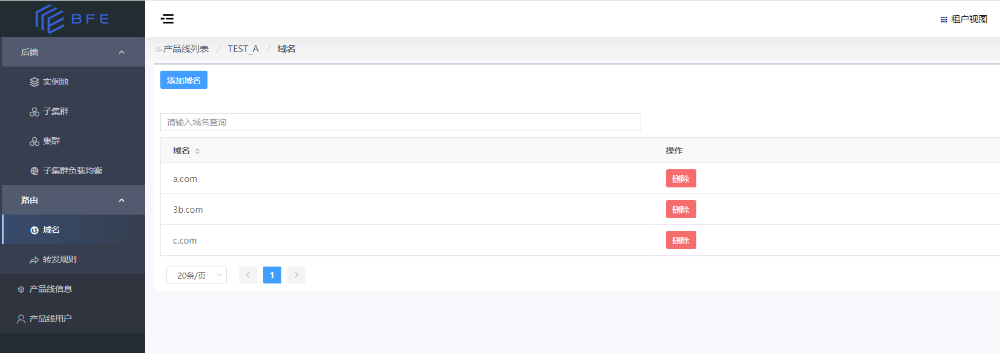
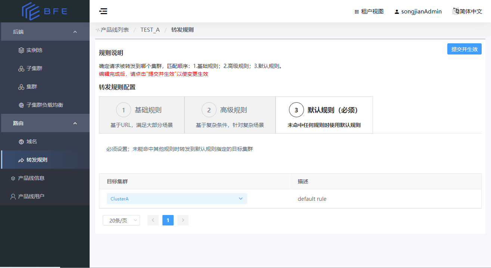
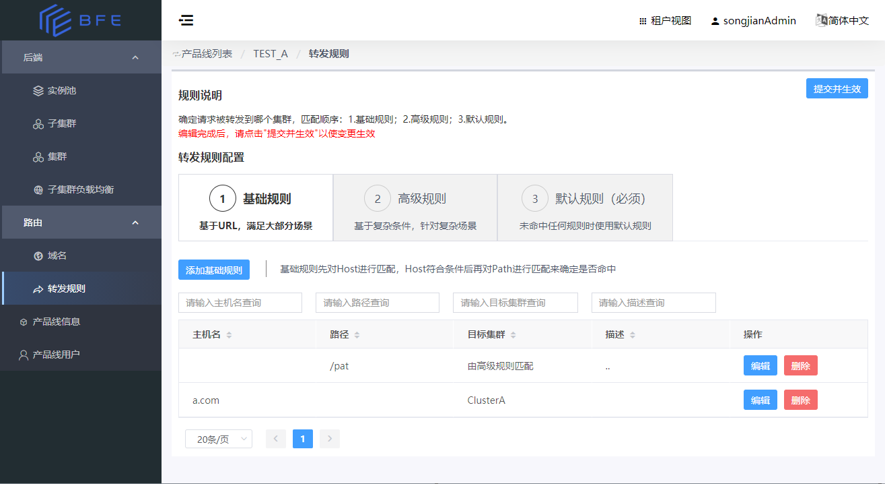
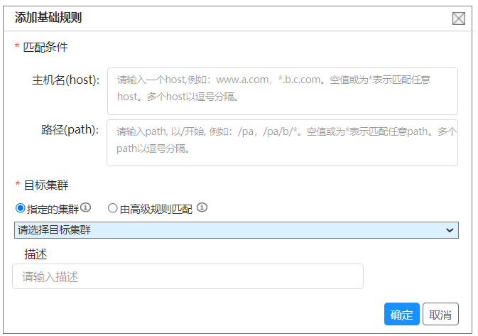
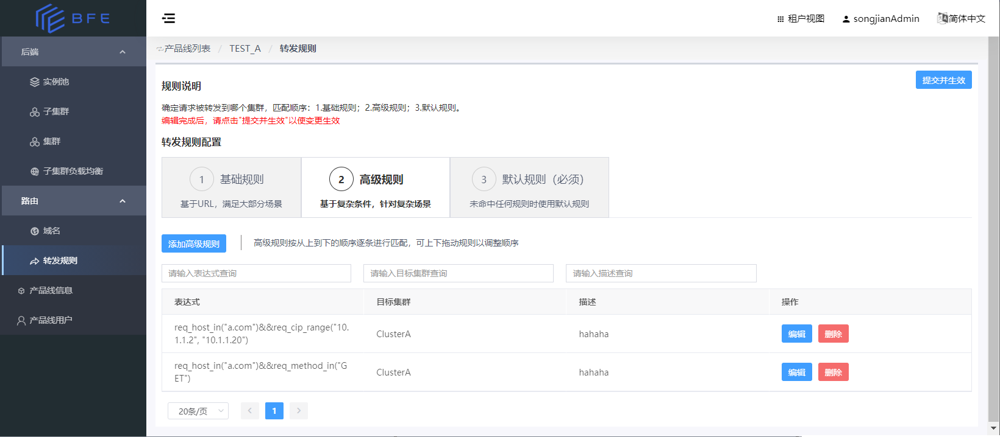
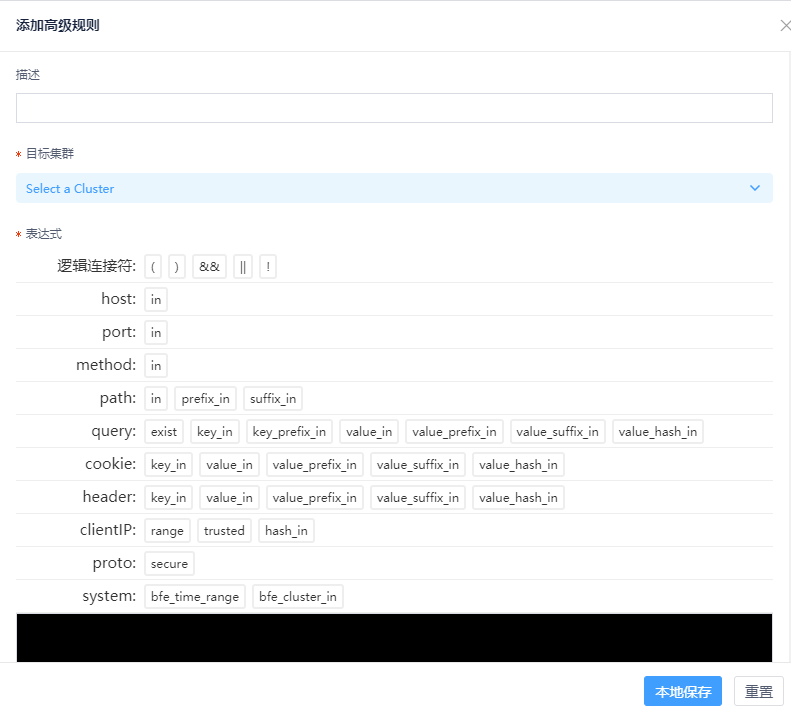

# 路由

## 路由概述

根据BFE的[流量接入转发模型](https://www.bfe-networks.net/zh_cn/introduction/forward_model/)，使用BFE进行流量接入转发时：

- 首先根据[域名规则](https://www.bfe-networks.net/zh_cn/configuration/server_data_conf/host_rule.data/)，确定产品线
- 然后根据[分流转发规则](https://www.bfe-networks.net/zh_cn/introduction/route/)，确定请求转发到哪个后端集群

BFE Dashboard可以配置域名规则和分流转发规则，下面分别进行说明。

## 域名

BFE根据域名来确定访问请求属于哪个产品线。

域名在整个BFE系统内不可重复。即某个产品线添加了一个域名后，系统内任何产品线均不能再添加相同的域名。

- 在租户视图，通过“路由”->“域名”，进入域名管理页面。

-   点击“添加域名”按钮，即可为产品线添加域名

## 转发规则

### 转发规则概述

#### 概念和原理

对于一个产品线的流量，可能需要由不同的集群（Cluster,指后端业务集群）来服务。

对于某个请求，在根据域名确定了请求属于某个产品线后，由该产品线配置的转发规则来决定请求转发到哪个集群。

每条转发规则包含匹配条件和目标集群，即满足匹配条件的请求转发到该目标集群。

在BFE Dashboard上，转发规则分为三种：基础规则（组成基础规则表）、高级规则（组成高级规则表）、默认规则。

- 基础规则：基础规则以域名(host)和路径(path)作为匹配条件，来确定目标集群，匹配速度快。基础规则还支持设置为满足指定的匹配条件后，转由高级规则去进一步匹配以确定目标集群。
- 高级规则：高级规则具有更强大的条件描述能力，支持更丰富的条件类型，但在规则数量较多时，匹配速度慢于基础规则。
- 默认规则：指定未命中其他两种规则时，请求转发至哪个目标集群

其中，每个产品线必须配置默认规则，而基础规则和高级规则可以根据实际需要配置。

#### 详细说明

关于转发规则的详细说明，请阅读[基于内容路由](https://www.bfe-networks.net/zh_cn/introduction/route/)。

#### 转发规则的配置步骤

转发规则的配置包括如下步骤：

1. 配置转发规则，其中包括：
   - 配置默认规则（必须）
   - 配置基础规则（按需）
   - 配置高级规则（按需）
   
3. 提交并生效

     - **注意：** 完成规则编辑后需要点击“提交并生效”按钮

### 配置默认规则

产品线必须设置默认规则，以指定未命中其他两种规则时的默认的目标集群。

新建的产品线的默认规则的目标集群为空，需要编辑以进行设置。

- 在租户视图，进入“路由”-\>“转发规则”页，进入“转发规则”标签下的“默认规则”标签，为默认规则设定一个目标集群

-   默认规则只需要设置目的集群
-   未设置默认规则时，无法配置基础规则和高级规则

### 配置基础规则

- 在租户视图，进入“路由”-\>“转发规则”页，进入“转发规则”标签下的“基础规则”标签，即可配置基础规则。

  

添加基础规则时，需要填写如下内容：

- 匹配条件：
  - 主机名(host): 规则匹配的host条件
  - 路径(path): 规则匹配的path条件
  - 其中，匹配条件的host和path中，至少填写一个。
- 目标集群：目标集群名。即命中该规则后，转发到哪个目标集群。特殊的取值为：由高级规则匹配。
- 描述：可选，对该条规则的描述

### 配置高级规则

- 在租户视图，进入“路由”-\>“转发规则”页，进入“转发规则”标签下的“高级规则”标签，即可配置基础规则。

#### 高级规则说明

高级规则列表由有顺序的多条“高级规则”组成。

-   高级规则的匹配条件使用了一个伪码描述机制“条件表达式”（Condition Expression，详见[Condition](https://www.bfe-networks.net/zh_cn/condition/condition_grammar/)）来表述。
    
-   目的集群通过集群名称来指定。

在查询时，BFE对多条高级规则顺序查找：

-   基于HTTP请求的信息，根据转发规则的匹配条件进行匹配计算，如果符合匹配条件则命中该转发规则。可以使用的请求信息包括：host，path，query，cookie，method，clientIP等
    
-   只要命中任何一条转发规则，就会由此确定目的集群并结束退出。

-   若所有转发规则都没有命中，将执行默认规则。

#### 添加高级规则

-   点击“添加高级规则”按钮，可以添加高级规则

-   对每条高级规则，包括

    -   **匹配条件(表达式)**：规则的匹配条件，以条件表达式的形式描述
    -   **目的集群**：如果这条规则命中，请求转发的目的集群
    -   **描述**：对规则的说明和描述

-   点击“本地保存”

#### 调整高级规则的优先级

在高级规则列表中，越靠前（靠上）的规则、优先级越高（即，越早被匹配）。可以通过鼠标拖动来改变规则在列表中的位置，从而改变规则的优先级。

### 基础规则和高级规则配合

基础规则和高级规则配合使用，可以用于各种复杂场景下的流量调度，例如基于cookie的灰度发布。详细说明，请阅读[基于内容路由](https://www.bfe-networks.net/zh_cn/introduction/route/)。

### 转发规则提交

-   **注意**：完成规则编辑后需要点击“提交并生效”按钮，以保存到服务器端并使之生效。
    -   **在未提交生效前离开转发规则页，会导致编辑的内容丢失**
        
    -   **编辑包括添加、修改、删除规则，以及调整高级规则的顺序**
-   以上的修改，在点击“提交并生效”之前，都不会保存到服务端，仅在本地保存。
-   请在确认各修改正确后，点击“提交并生效”按钮

